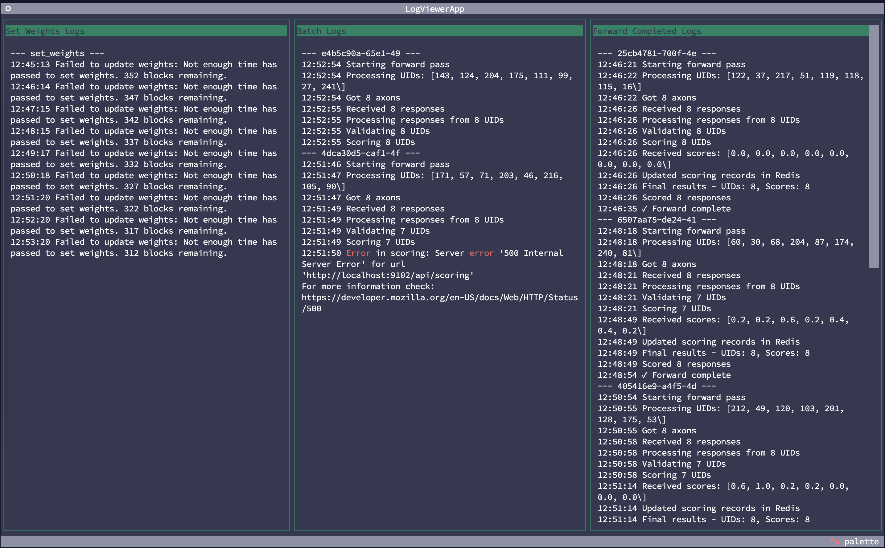

<br /><br />
<div align="center">
  <h1 align="center">condenses-validating</h1>
  <h4 align="center"> Orchestrating validating process that connects with other condenses services</div>

## Installation

To install the necessary components, run the following commands:

```bash
pip install git+https://github.com/condenses/condenses-validating.git
pip install uv
uv venv
. .venv/bin/activate
uv sync --prerelease=allow
. scripts/install_redis.sh
```

## Quick Start

### 1. Setup LLM Inference

You can choose between self-hosted LLM inference or using the free LLM Inference from Subnet 19 - Nineteen.

#### 1.1 Self-hosted LLM Inference

*Requires A100 or H100 GPU*

```bash
export HF_TOKEN=your_huggingface_token
./scripts/install_vllm.sh
```

#### 1.2 Free LLM Inference from Subnet 19 - Nineteen

```bash
echo "USE_NINETEEN_API=true" >> .env
echo "VLLM_CONFIG__MODEL_NAME=chat-llama-3-1-70b" >> .env
```

### 2. Synthesizing

To start the synthesizing service, run:

```bash
echo "HF_TOKEN=your_huggingface_token" >> .synthesizing.env
pm2 start --name "synthesizing" "gunicorn condenses_synthesizing.server:app --worker-class uvicorn.workers.UvicornWorker --bind 127.0.0.1:9100"
```

### 3. Node Managing

To start the node managing service, run:

```bash
pm2 start --name "node_managing" "gunicorn condenses_node_managing.server:app --worker-class uvicorn.workers.UvicornWorker --bind 127.0.0.1:9101"
```

### 4. Scoring

Set the environment variables and start the scoring service:

```bash
echo "VLLM__BASE_URL=http://localhost:8000" >> .env
pm2 start --name "scoring" "gunicorn text_compress_scoring.server:app --worker-class uvicorn.workers.UvicornWorker --bind 127.0.0.1:9102"
```

### 5. Restful Bittensor

Set the environment variables and start the restful bittensor service:

```bash
echo "WALLET_NAME=default" >> .env
echo "WALLET_HOTKEY=default" >> .env
echo "WALLET_PATH=~/.bittensor/wallets" >> .env
pm2 start --name "restful_bittensor" "gunicorn restful_bittensor.server:app --worker-class uvicorn.workers.UvicornWorker --bind 127.0.0.1:9103"
```

### 6. Validating

Set the environment variables and start the validating service:

```bash
echo "SYNTHESIZING__BASE_URL=http://localhost:9100" >> .env
echo "NODE_MANAGING__BASE_URL=http://localhost:9101" >> .env
echo "SCORING__BASE_URL=http://localhost:9102" >> .env
echo "RESTFUL_BITTENSOR__BASE_URL=http://localhost:9103" >> .env
pm2 start --name "validating" "condenses-validating"
```

### 7. Log Viewer

To view logs, run the following command:

```bash
python condenses_validating/log_viewer.py
```



## Related Repositories

- [Subnet Node Managing](https://github.com/condenses/subnet-node-managing)
- [Text Compress Scoring](https://github.com/condenses/text-compress-scoring)
- [Restful Bittensor](https://github.com/condenses/restful-bittensor)
- [Subnet Synthesizing](https://github.com/condenses/subnet-synthesizing)
